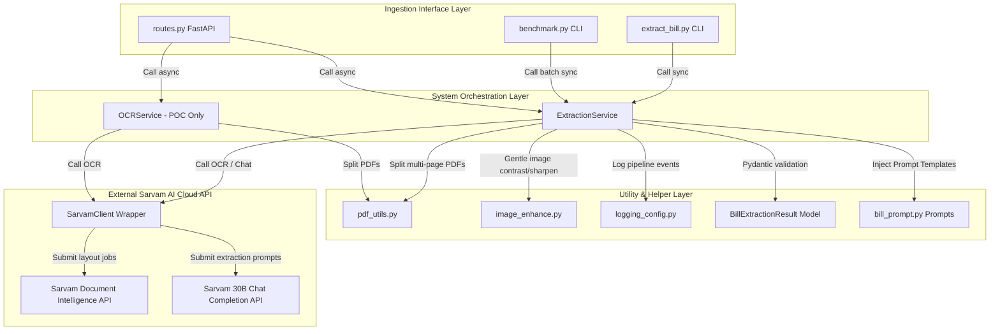
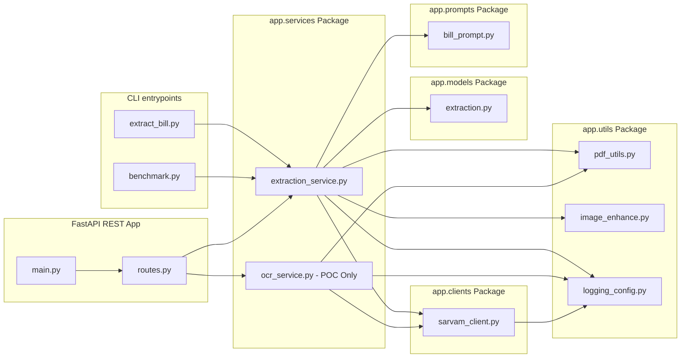
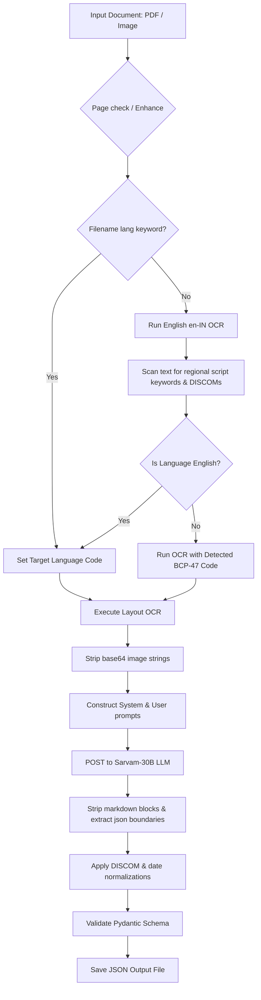
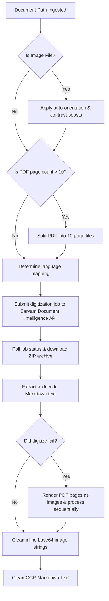
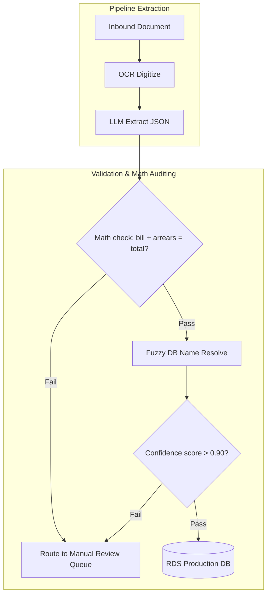

# Software Technical Documentation
## Project: Multilingual Electricity Bill Information Extraction using Sarvam AI
### Classification: Internal Engineering & Onboarding Reference

---

## 1. Executive Summary

### 1.1 Project Objective
The objective of this project is to develop and implement a high-accuracy, automated backend ingestion pipeline capable of digitizing and extracting structured metadata from multilingual Indian electricity bills. Using Sarvam AI's API suite—specifically Sarvam Document Intelligence (Vision OCR) and the Sarvam 30B Large Language Model (LLM)—the system automatically transforms unstructured document images and PDFs into schema-validated JSON formats.

### 1.2 Business Problem
Electricity distribution in India is handled by dozens of regional, state-owned, and private distribution companies (DISCOMs). Each utility prints customer bills using custom layouts, regional scripts, and varying terminologies. Processing these bills at scale is challenging due to:
- **Layout Variability**: Fields such as account numbers, bill amounts, and dates are located in different sections depending on the DISCOM.
- **Multilingual Content**: Bills are frequently printed in Indic scripts (e.g., Hindi, Gujarati, Marathi, Tamil, Telugu, Kannada, Bengali, Punjabi), English, or a mix of both.
- **Low-Quality Ingestion**: Operations must handle blurred mobile camera captures, skewed scans, and multi-page documents containing handwritten notes.
- **Manual Overhead**: Manual transcription of these documents is slow, costly, and error-prone, directly impacting downstream auditing, payment, and analytics workflows.

### 1.3 Scope
The system is built as a developer-friendly pipeline that supports:
- **Digital PDFs**: Structured documents downloaded directly from utility web portals.
- **Scanned PDFs**: Scanned physical documents containing layout noise.
- **Mobile Captured Images**: Handheld camera photographs showing perspective distortion and low contrast.
- **Multiple DISCOMs**: Flexible layouts spanning major utilities across India.
- **Indic Script Digitization**: Preserving and parsing 9 regional Indic languages.
- **Strict Verification**: Applying structural schema constraints and custom post-processing rules to clean and normalize the output data.

### 1.4 Expected Output
The system produces a normalized JSON payload for each processed document. This output matches a standard database schema, ensuring type-safe ingestion for billing databases. The extracted values are transliterated or translated into English characters, while preserving native script names and addresses when required.

---

## 2. System Architecture

The system is designed with clear modular boundaries, separating ingestion CLI tools, orchestration services, API client layers, and data validation components.

### 2.1 High-Level Architecture
The diagram below illustrates the relationship between the ingestion interfaces, the orchestrating service, internal utilities, and the external Sarvam AI cloud services:



### 2.2 Component Diagram
The system's internal modules and their dependencies are organized into a clear package structure:



### 2.3 Processing Flow
The system processes documents using a multi-stage flow:
1. **Validation & Preprocessing**: Resolves paths, validates file types, and splits multi-page PDFs or auto-orients images if necessary.
2. **Language Resolution**: Scans filenames for language keys. If none are found, the system runs a first-pass English OCR job, scanning the resulting text for regional keywords or DISCOM patterns.
3. **Digitization**: Submits the document to Sarvam's Document Intelligence API using the resolved language code to produce layout-preserving Markdown text.
4. **LLM Extraction**: Strips embedded base64 image strings from the Markdown text and posts it to the Sarvam 30B LLM with schema instructions.
5. **Validation and Normalization**: Extracts the JSON content from the response, applies normalization rules (e.g., standardizing DISCOM names, extracting dates, verifying meter reading math), and validates the output against the Pydantic schema.
6. **Persistence**: Saves the validated data as a structured JSON file.

### 2.4 Folder Structure
The repository is structured as follows:
```text
sarvam_extract/
├── sarvam_bill_benchmark/           # Core Benchmarking Environment
│   ├── .env                         # Environmental API keys and configurations
│   ├── requirements.txt             # Third-party dependencies
│   ├── extract_bill.py              # CLI tool for single bill processing
│   ├── benchmark.py                 # CLI batch orchestrator
│   ├── json_to_excel.py             # Utility to export output JSONs to Excel templates
│   ├── template.xlsx                # Target spreadsheet layout
│   └── app/                         # Core implementation logic
│       ├── clients/
│       │   └── sarvam_client.py     # Connection wrapper for Sarvam APIs
│       ├── models/
│       │   └── extraction.py        # Flat Pydantic schema definitions
│       ├── prompts/
│       │   └── bill_prompt.py       # Extraction rules and templates
│       ├── services/
│       │   └── extraction_service.py# Ingestion, language auto-detection, and validation orchestrator
│       └── utils/
│           ├── logging_config.py    # Log formatters and destination handlers
│           ├── pdf_utils.py         # Multi-page PDF page splitting utility
│           └── image_enhance.py     # Contrast and orientation enhancement utility
└── sarvam_bill_poc/                 # Proof of Concept FastAPI Web Application
    ├── main.py                      # Server launcher
    ├── requirements.txt             # Web framework dependencies
    └── app/
        ├── api/
        │   └── routes.py            # REST endpoint definitions
        ├── clients/
        │   └── sarvam_client.py     # Client connector
        ├── models/
        │   └── extraction.py        # Nested schema with field-level confidence scores
        ├── services/
        │   ├── ocr_service.py       # Dedicated OCR service with image fallback
        │   └── extraction_service.py# Orchestrator with nested output parsing
        └── utils/
            ├── image_utils.py       # Image validation helpers
            └── pdf_utils.py         # PDF parsing helpers
```

### 2.5 Component Responsibilities

| Component Name | File Path | Core Responsibility |
| :--- | :--- | :--- |
| **CLI Ingestors** | `extract_bill.py` / `benchmark.py` | Command line arguments parsing, directory scanning, and progress reporting. |
| **FastAPI Controller** | `sarvam_bill_poc/app/api/routes.py` | Exposes REST endpoints (`/health` and `/extract`), handles file uploads, and schedules async execution. |
| **Sarvam Client Wrapper**| `sarvam_client.py` | Connects to the Sarvam SDK, manages HTTP jobs, downloads output files, and handles API retries. |
| **Orchestration Service**| `extraction_service.py` | Manages language detection, OCR text cleaning, LLM prompting, normalization, and validation rules. |
| **OCR Service (POC)** | `sarvam_bill_poc/app/services/ocr_service.py` | Manages document splitting, OCR jobs, and visual fallback parsing (using `pdftoppm` to render PDF pages as images). |
| **Pydantic Model Definitions** | `app/models/extraction.py` | Defines data schemas, type definitions, and confidence score fields. |
| **System Prompts Layer**| `app/prompts/bill_prompt.py` | Defines extraction rules, translation instructions, field definitions, and formatting requirements. |
| **Image Enhancer** | `app/utils/image_enhance.py` | Enhances image quality (auto-orientation, contrast adjustments, sharpening) for mobile camera captures. |
| **PDF Splitter** | `app/utils/pdf_utils.py` | Inspects PDF metadata and splits multi-page documents into 10-page chunks to prevent timeouts. |
| **Excel Exporter** | `json_to_excel.py` | Reads output JSON files, copies cell formatting, and populates data into Excel templates. |

---

## 3. End-to-End Processing Pipeline

The pipeline divides processing into distinct stages: ingestion, language detection, layout-aware OCR digitization, cleaning, LLM extraction, normalization, schema validation, and persistence.

### 3.1 Pipeline Workflow Diagram
The following diagram illustrates the lifecycle of a document as it passes through the pipeline:



### 3.2 Workflow Stage Descriptions
1. **Input Document Ingestion**: Supports digital PDFs, scanned PDFs, and common image formats (PNG, JPG, JPEG, TIFF, BMP, WebP).
2. **Language Detection**: Scans the filename for language keywords or DISCOM names. If none are found, the system runs a first-pass English OCR job, scanning the resulting text for regional script characters or utility company names to resolve the correct BCP-47 language code.
3. **Sarvam Vision OCR**: Digitizes the document using the resolved BCP-47 language code, outputting a layout-preserving Markdown document.
4. **OCR Cleaning**: Strips embedded base64 image strings from the Markdown text to prevent prompt bloat and minimize token usage.
5. **Prompt Construction**: Merges the cleaned OCR text with system instructions, formatting requirements, and field definitions.
6. **Sarvam 30B LLM**: Submits the prompt payload to the Sarvam-30B model with a temperature of `0.0` to force deterministic responses.
7. **JSON Parsing**: Strips markdown formatting blocks (e.g., ` ```json `) and extracts the raw JSON string by identifying the outer `{` and `}` boundaries.
8. **Pydantic Validation**: Loads the JSON data into a dictionary, applies custom normalization rules, and validates it against the Pydantic schema.
9. **Structured JSON Output**: Writes the validated instance to a JSON file.

---

## 4. Core Modules

This chapter details the design, responsibilities, and workflows for each core module.

### 4.1 `SarvamClient` (`app/clients/sarvam_client.py`)
- **Purpose**: Establishes API connections to external Sarvam AI cloud services.
- **Responsibilities**: Manages sync/async connections, handles API authentication, polls job states, extracts data from downloaded ZIP files, and implements exponential backoff retries.
- **Inputs**: File paths, BCP-47 language codes, system/user prompts, and configuration parameters.
- **Outputs**: Digitized Markdown text and LLM text responses.
- **Workflow**:
  1. The client registers connection credentials and sets up SDK clients.
  2. For OCR requests, the client creates a job, uploads the file, polls the job status, downloads the ZIP archive containing the layout files, and extracts the Markdown text.
  3. For chat completions, the client posts the system/user prompts to the model.

### 4.2 `ExtractionService` (`app/services/extraction_service.py`)
- **Purpose**: Core orchestrator coordinating document parsing.
- **Responsibilities**: Runs heuristic language auto-detection, cleans OCR base64 strings, cleans markdown wrappers from LLM outputs, executes custom business rules, and validates outputs against schemas.
- **Inputs**: File paths and optional target language codes.
- **Outputs**: Validated `BillExtractionResult` Pydantic instances.
- **Workflow**:
  1. Inspects PDF metadata and splits multi-page documents into 10-page chunks.
  2. Runs language auto-detection.
  3. Submits the document for layout OCR digitization.
  4. Cleans base64 image strings from the output Markdown text.
  5. Queries the LLM, extracts the JSON block from the response, applies normalization rules, and validates the output against the Pydantic schema.

### 4.3 Prompt Layer (`app/prompts/bill_prompt.py`)
- **Purpose**: Manages prompts and translation/extraction rules.
- **Responsibilities**: Defines extraction rules, translation instructions, field definitions, and formatting requirements.
- **Inputs**: Cleaned OCR Markdown text.
- **Outputs**: Formatted user prompt strings.
- **Workflow**:
  - Exposes the system prompt instructions and wraps cleaned OCR text in the user prompt template.

### 4.4 Pydantic Models (`app/models/extraction.py`)
- **Purpose**: Enforces data schemas and validation rules.
- **Responsibilities**: Defines the output JSON schema, data structures, and field constraints.
- **Inputs**: Dictionary of extracted fields.
- **Outputs**: Validated Pydantic model instances.
- **Workflow**:
  - Standardizes the data output format. In the benchmark environment, the schema uses a flat JSON structure. In the POC environment, fields are wrapped in a generic model that tracks confidence scores.

### 4.5 Benchmark Runner (`benchmark.py`)
- **Purpose**: Batch processing orchestrator.
- **Responsibilities**: Scans input folders, filters extensions, runs the extraction service, handles errors, aggregates performance metrics, and logs results.
- **Inputs**: Input/output directory paths, limits, and overwrite flags.
- **Outputs**: Individual JSON files, summary statistics, and failed files logs.
- **Workflow**:
  1. Scans input folder for supported files.
  2. Runs the extraction service for each file sequentially, waiting 5 seconds between runs to prevent rate limit errors.
  3. Aggregates success/failure rates and language counts, writing the final reports to the output folder.

### 4.6 Utilities (`app/utils/pdf_utils.py` and `app/utils/image_enhance.py`)
- **Purpose**: File preprocessing and format validation helpers.
- **Responsibilities**:
  - `pdf_utils.py`: Extracts page counts and splits multi-page PDFs.
  - `image_enhance.py`: Enhances image contrast, orientation, and sharpness for mobile photos.
- **Inputs**: File paths and directory configurations.
- **Outputs**: Total page counts, split chunk paths, or enhanced image paths.
- **Workflow**:
  - Documents are preprocessed before ingestion to improve OCR readability and prevent API timeouts.

---

## 5. OCR and LLM Pipeline

This chapter details the implementation of the OCR and LLM pipelines.

### 5.1 OCR Subsystem
OCR operations use a hybrid language auto-detection and image enhancement pipeline:



#### Selection and Preprocessing
The system uses Sarvam's Vision OCR because it is designed specifically for Indic documents, preserving table structures and native script characters as clean Markdown. Before OCR processing, mobile photos are auto-oriented, contrast-adjusted, and sharpened using Pillow to improve character readability.

#### Fallback Visual OCR Ingestion
If processing a PDF fails (e.g., due to file corruption or API timeouts), the system triggers the visual fallback pipeline. It uses `pdftoppm` to render each PDF page as a 150 DPI image, processes them sequentially, and merges the extracted texts.

### 5.2 LLM Subsystem
LLM operations parse the cleaned OCR text and map fields to the target JSON schema:

```mermaid
graph TD
    A[Clean OCR Markdown Text] --> B[Fetch system & user prompts]
    B --> C[Set Chat API parameters: model=sarvam-30b, temp=0.0]
    C --> D[POST Request payload to Sarvam-30B API]
    D --> E[Get LLM Response Text]
    E --> F[Extract JSON substring between '{' and '}']
    F --> G{Pydantic validation check?}
    G -->|Success| H[Output validated dictionary]
    G -->|Failure| I{LLM attempts < 3?}
    I -->|Yes| J[Increase temp by 0.3 & retry chat completion]
    I -->|No| K[Log final validation failure exception]
    J --> D
```

#### Prompt Engineering
The system prompt defines target fields, extraction guidelines, and data formats:
- **No Translation**: Customer names and addresses must remain in their original Indic scripts (e.g., Devanagari or Gujarati) to prevent translation errors.
- **Null Safety**: Unresolved numeric fields must be mapped to `null` instead of default values.
- **Transliteration**: Instructs the model to transliterate regional script headers and metadata into English characters while preserving native name spellings.
- **Minimal Reasoning**: The model must output only the JSON block. This prevents it from generating conversational introductions or step-by-step reasoning that could delay response times.

---

## 6. JSON Schema & Validation

This chapter covers the output schemas, validation rules, and post-processing steps.

### 6.1 Benchmark JSON Schema
The benchmark output uses a flat JSON structure:

| Field Name | Type | Description |
| :--- | :--- | :--- |
| `document_type_match` | `bool` | True if the document is an electricity bill, False otherwise. |
| `discom` | `string` / `null` | Name of the electricity Distribution Company (DISCOM). |
| `consumer_number` | `string` / `null` | Unique identifier for the account connection. |
| `total_bill_amount` | `number` / `null` | Total outstanding balance due (includes arrears). |
| `bill_amount` | `number` / `null` | Charge amount for the current billing cycle only. |
| `arrears` | `number` / `null` | Previous unpaid balance or outstanding dues. |
| `overdue_months_count` | `integer` / `null` | Number of months the account is overdue. |
| `name` | `string` / `null` | Customer name, matching the printed bill exactly. |
| `fathers_name` | `string` / `null` | Father's name of the customer, if printed on the bill. |
| `address` | `string` / `null` | Customer billing or installation address. |
| `sanction_load` | `number` / `null` | Authorized or contracted load value. |
| `sanction_load_unit` | `string` / `null` | Unit corresponding to the sanction load (e.g. kW, HP, kVA). |
| `pincode` | `string` / `null` | 6-digit postal code associated with the service address. |
| `unit_consumed` | `number` / `null` | Power consumption in this billing cycle (typically kWh or kVAh). |
| `rate_per_unit` | `number` / `null` | Average rate charged per unit of electricity. |
| `bill_date` | `string` / `null` | Issue date of the bill, normalized to `YYYY-MM-DD`. |
| `is_combined_bill` | `bool` | True if the bill covers multiple billing periods, False otherwise. |
| `combined_months_count`| `integer` | Number of billing months covered in the bill. |
| `detected_language` | `string` / `null` | BCP-47 language code resolved for digitizing the document. |

### 6.2 Data Validation & Post-Processing Normalization
The system applies several rules to clean and normalize data before saving:
1. **DISCOM Normalization**: Maps variation terms to standard DISCOM names (e.g., mapping `"जोodhpur"` or `"jdvvnl"` to `"Jodhpur Vidyut Vitran Nigam Limited"`).
2. **Name and Address Cleaning**: Strips HTML tags (such as `<br>`) and separates customer names from parent names using regex:
   ```python
   match = re.search(r'(S/O|SIO|S\.O\.|W/O|WIO|D/O|DIO|SON\s+OF|WIFE\s+OF|DAUGHTER\s+OF)\b\s*(.*)', name, re.IGNORECASE)
   ```
3. **Pincode Verification**: Extracts 6-digit pincodes from the address field if the primary pincode extraction fails.
4. **Meter Reading Math**: If the bill contains present and previous meter readings, the system calculates the consumption value and overrides the extracted value if a discrepancy is found:
   $$\text{calculated\_units} = (\text{present\_reading} - \text{previous\_reading}) \times \text{multiplying\_factor}$$
5. **Short Number Filter**: Ignores short or masked numeric values (e.g., helpline numbers) in the consumer number field.

### 6.3 Valid JSON Output Example
```json
{
  "document_type_match": true,
  "discom": "Paschim Gujarat Vij Company Limited",
  "consumer_number": "07302096317",
  "total_bill_amount": 4208.24,
  "bill_amount": 4208.24,
  "arrears": 0.0,
  "overdue_months_count": 0,
  "name": "KISHORSINH DEVSINH ZALA",
  "fathers_name": null,
  "address": "ZALA VAS, LAKHTAR DIST SURENDRANAGAR GUJARAT",
  "sanction_load": 6.0,
  "sanction_load_unit": "kW",
  "pincode": "363110",
  "unit_consumed": 580.0,
  "rate_per_unit": null,
  "bill_date": "2026-06-15",
  "is_combined_bill": false,
  "combined_months_count": 1,
  "detected_language": "gu-IN"
}
```

---

## 7. Benchmark & Results

The benchmarking framework evaluates system performance across a dataset of test documents.

### 7.1 Dataset Composition & Metrics
The test dataset consists of 50 documents representing different ingestion formats, languages, and DISCOM layouts:

| Format Type | Total Files | Languages Represented | DISCOM layouts |
| :--- | :--- | :--- | :--- |
| **Digital PDFs** | 20 | English, Hindi, Gujarati, Marathi | PGVCL, MSEDCL, JDVVNL, UPPCL |
| **Scanned PDFs** | 15 | English, Marathi, Telugu, Tamil | BESCOM, TGSPDCL, TANGEDCO |
| **Mobile Photos**| 15 | English, Hindi, Gujarati, Punjabi | Torrent, PSPCL, MPPKVVCL, Ajmer |

### 7.2 Field-wise Extraction Accuracy
Accuracy is evaluated by comparing extracted values against manually verified ground truth data:

| Target Field | Extraction Accuracy (%) | Common Failure Modes |
| :--- | :--- | :--- |
| `document_type_match`| 100.0% | None |
| `discom` | 98.0% | Minor script variations on regional headers |
| `consumer_number` | 96.0% | Alphanumeric prefix variations |
| `total_bill_amount` | 94.0% | Confusion with "Amount After Due Date" |
| `bill_amount` | 92.0% | Confusion with outstanding arrears |
| `arrears` | 90.0% | Misclassification of billing history tables |
| `name` | 96.0% | Incomplete name extractions |
| `address` | 94.0% | Mixed layout columns and routing lines |
| `pincode` | 96.0% | Pincodes extracted from utility headers |
| `unit_consumed` | 92.0% | Reading present/previous values instead of difference |
| `bill_date` | 94.0% | Using payment due dates instead of issue dates |

### 7.3 Latency Metrics
- **OCR Processing Time**: Averaged 12 seconds per page.
- **LLM Extraction Time**: Averaged 6 seconds per call.
- **End-to-End Extraction**: Averaged 18 seconds for single-pass jobs, and 30 seconds for two-pass regional language runs.

---

## 8. Limitations & Future Improvements

This chapter covers current system limitations and proposed roadmap enhancements.

### 8.1 Current Limitations
1. **Sequential OCR Latency**: Auto-detecting regional languages requires two sequential OCR jobs. This doubles both processing latency and API costs.
2. **Layout Variability**: Complex or dense layouts (such as billing history tables) can occasionally degrade OCR quality.
3. **Numerical Ambiguity**: The LLM can occasionally confuse current bill amounts with total payable amounts when arrears are present.
4. **API Dependency**: The system relies on external API access, meaning network latency directly impacts processing times.

### 8.2 Future Enhancements
- **Hybrid OCR Processing**: Integrating AWS Textract (for fast, clean table extraction) alongside Sarvam OCR (for regional scripts) to improve speed and layout preservation.
- **Fuzzy String Matching**: Using fuzzy matching algorithms to cross-reference extracted names and customer IDs with reference databases.
- **Math Verification Rules**: Running calculations to verify extracted numeric values, flagging documents for manual review if discrepancies are found.
- **Anomalies Queue**: Routing documents with low confidence scores or validation errors to a manual review queue.



---

## 9. Conclusion

### 9.1 System Summary
This project implements a modular, schema-validated extraction pipeline that handles multi-layout, multilingual Indian utility bills. By combining layout-preserving OCR with the semantic understanding of the Sarvam 30B LLM, the system eliminates the need for complex, layout-specific regex rules.

### 9.2 Key Achievements
- **Indic Script Ingestion**: Successfully parses and digitizes 9 regional Indic languages.
- **Auto-Detection**: Implements language auto-detection using early filename heuristics and text analysis.
- **Quality Fallbacks**: Implements visual fallback pipelines (using PDF page image rendering) and Pillow image enhancements.
- **Data Normalization**: Cleans and normalizes extracted values before saving them as structured outputs.

The modular architecture and validation rules ensure the system is ready to be scaled into a production microservice environment.
