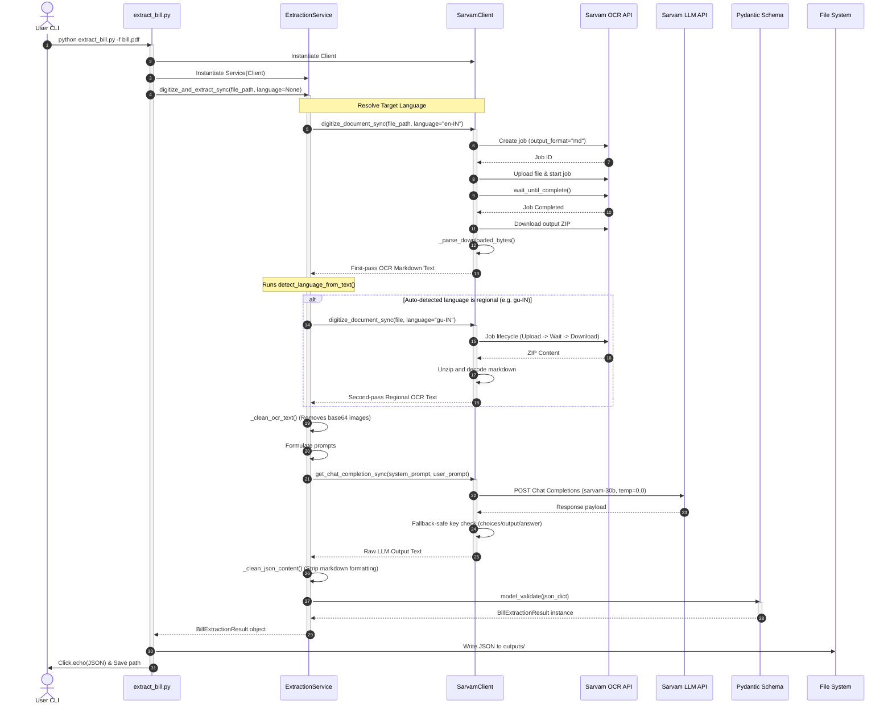
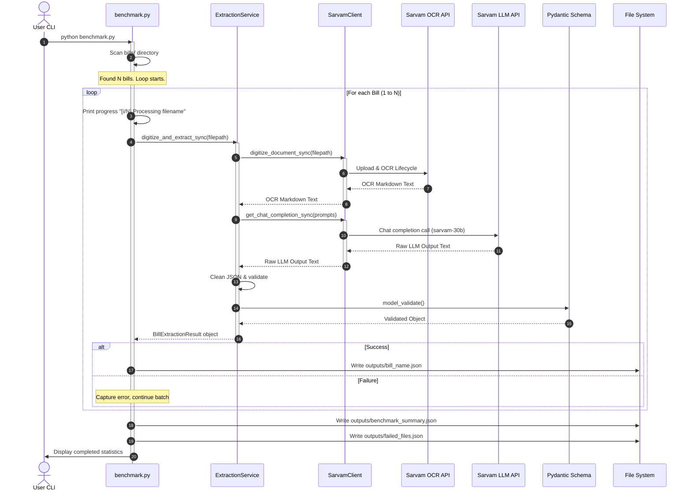
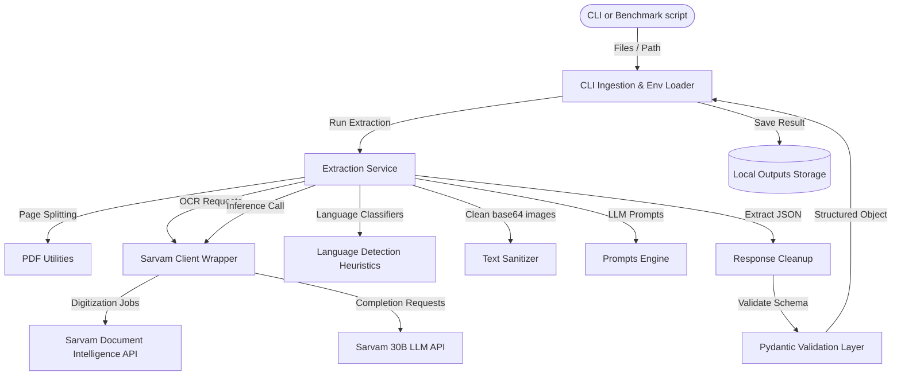
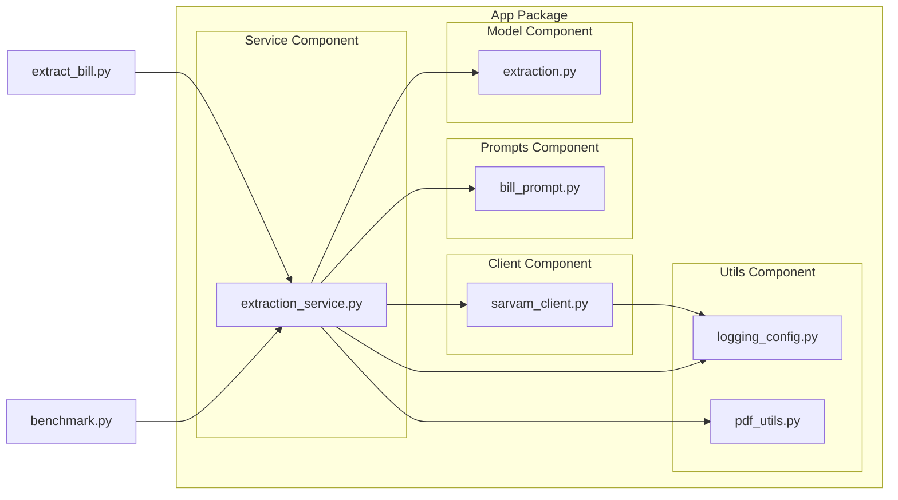
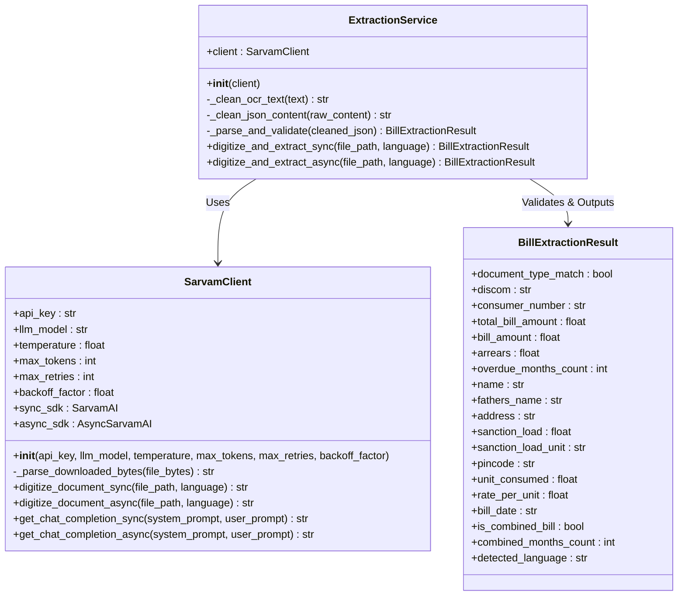
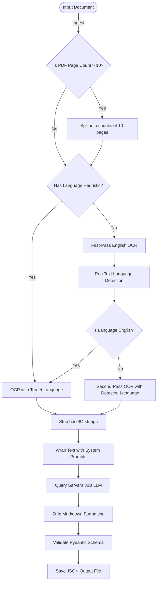
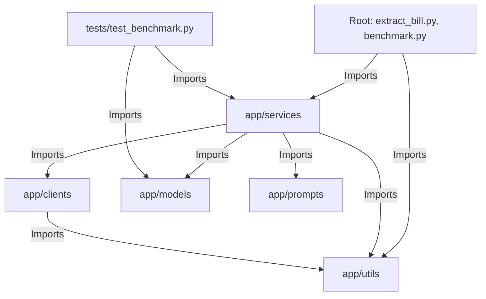

# Architecture & Design Reference Guide: Sarvam AI Electricity Bill Benchmark

This document provides a comprehensive technical overview of the **Sarvam AI Electricity Bill Benchmark** project. It is designed to serve as an onboarding guide and reference manual for engineers joining the project or integrating its capabilities into a production system.

---

## 1. Executive Summary

### Project Purpose
The primary purpose of this project is to evaluate, benchmark, and deploy a high-accuracy, automated system that extracts structured information from highly variable, multilingual Indian electricity bills using **Sarvam AI's API suite**.

### Problem Being Solved
Utility bills in India present a significant data extraction challenge:
- **High Visual Diversity**: Dozens of state-owned and private distribution companies (DISCOMs) use different page layouts, table designs, and formatting styles.
- **Multilingual Content**: Bills are frequently printed in regional Indic scripts (e.g., Hindi, Gujarati, Marathi, Telugu, Tamil, Kannada, Bengali, Punjabi), English, or a colloquial mix of both.
- **Scanning Artifacts**: Input documents are often low-quality scans, mobile photos, or multi-page PDFs containing embedded images and handwritten marks.
- **Manual Overhead**: Manual transcription of these bills is slow, error-prone, and scales poorly.

### Why Sarvam AI is Being Used
Sarvam AI provides a specialized Indic-first AI stack:
1. **Document Intelligence OCR**: State-of-the-art layout-aware and script-aware OCR that supports regional Indian scripts and converts PDF/image documents into structured Markdown while retaining tabular layouts.
2. **Sarvam 30B LLM**: A large language model trained extensively on Indian languages and cultural contexts, making it highly effective at understanding regional utility bills and extracting structured JSON data without losing critical semantic meaning.

### Current Benchmark Objective
The benchmark framework is designed to run sequential extraction pipelines across a batch of diverse utility bills. It evaluates the performance of the Sarvam AI stack, measuring:
- **Extraction Accuracy**: Validation of extracted fields against a strict Pydantic schema.
- **System Latency**: Per-document execution time for OCR and LLM calls.
- **Pipeline Reliability**: Success rates, retry performance, and API stability.

### Expected Inputs
- **Supported File Types**: `.pdf`, `.png`, `.jpg`, `.jpeg`, `.tiff`, `.bmp`, `.webp`
- **Location**: A flat input directory (defaults to `bills/`).
- **Language**: Optional language code (BCP-47); if omitted, the system dynamically auto-detects it.

### Expected Outputs
- **Structured JSON Results**: A normalized JSON file for each processed bill, conforming to the defined target schema, saved under `outputs/`.
- **Benchmark Summary Report**: A consolidated JSON report (`outputs/benchmark_summary.json`) detailing document statistics and detected languages.
- **Failed Files Log**: A JSON mapping (`outputs/failed_files.json`) linking failed filenames to their corresponding error messages.

---

## 2. Repository Structure

Below is the directory tree of the repository, highlighting all functional components:

```text
sarvam_bill_benchmark/
├── .env                          # Local environment variable configuration (API keys, LLM config)
├── .env.example                  # Template listing expected configuration keys
├── requirements.txt              # Project dependencies and minimum versions
├── README.md                     # Setup instructions and CLI execution guides
├── extract_bill.py               # Standalone CLI script to process a single bill (Synchronous)
├── benchmark.py                  # Batch processing and benchmarking orchestrator (Asynchronous)
├── ARCHITECTURE.md               # Comprehensive design and architectural document (This file)
├── SYSTEM_ARCHITECTURE.md        # Legacy/Alternative design architecture document
├── app/                          # Core application logic package
│   ├── __init__.py               # Package marker
│   ├── clients/                  # API client wrappers
│   │   ├── __init__.py
│   │   └── sarvam_client.py       # Wrapper for Sarvam AI OCR and Chat Completion APIs (Sync/Async)
│   ├── models/                   # Data modeling and serialization
│   │   ├── __init__.py
│   │   └── extraction.py          # Pydantic schema definition for bill attributes
│   ├── prompts/                  # Prompt engineering templates
│   │   ├── __init__.py
│   │   └── bill_prompt.py         # System and user prompts for extraction
│   ├── services/                 # Workflow orchestrators
│   │   ├── __init__.py
│   │   └── extraction_service.py  # Core extraction pipeline logic and language detection
│   └── utils/                    # Shared utilities
│       ├── __init__.py
│       ├── logging_config.py      # Centrally configured rotating file & console logger
│       └── pdf_utils.py          # PDF helper utilities (page counter and chunk splitter)
├── bills/                        # Default directory containing input bills for benchmark runs
├── outputs/                      # Output directory containing JSON results and run reports
└── tests/                        # Automated unit tests
    ├── __init__.py
    └── test_benchmark.py         # Unit tests validating cleaners and validators
```

### File-by-File Metadata Summary

| File Path | Purpose / Responsibilities | Input(s) | Output(s) | Key Dependencies |
| :--- | :--- | :--- | :--- | :--- |
| [extract_bill.py](file:///Users/adityakachhot/sarvam%20extract/sarvam_bill_benchmark/extract_bill.py) | CLI entrypoint for single-bill processing. Handles arguments, invokes the extraction service, saves the result, and logs outputs. | CLI arguments (`--file`, `--lang`, `--output`) | Individual JSON file; stdout printout | `click`, `dotenv`, `ExtractionService`, `setup_logging` |
| [benchmark.py](file:///Users/adityakachhot/sarvam%20extract/sarvam_bill_benchmark/benchmark.py) | Batch benchmark runner to scan the bills/ folder and process all supported files sequentially. Generates statistics. | CLI arguments (`--bills-dir`, `--output-dir`) | Individual JSONs, `outputs/benchmark_summary.json`, `outputs/failed_files.json` | `click`, `dotenv`, `ExtractionService`, `setup_logging` |
| [sarvam_client.py](file:///Users/adityakachhot/sarvam%20extract/sarvam_bill_benchmark/app/clients/sarvam_client.py) | Wrapper around the official Sarvam AI SDK. Implements token cleanup, ZIP download parsing, sync/async OCR jobs, chat completions, and exponential backoff retry logic. | File paths, API key, model parameters, system/user prompt strings | Digitized Markdown strings, LLM text completion | `sarvamai` SDK, `zipfile`, `io`, `asyncio`, `tempfile` |
| [extraction_service.py](file:///Users/adityakachhot/sarvam%20extract/sarvam_bill_benchmark/app/services/extraction_service.py) | Core orchestrator coordinating document parsing. Implements heuristics for language auto-detection, cleans OCR base64 artifacts, strips LLM markdown tags, and runs schema validation. | File path, target language string | `BillExtractionResult` Pydantic object | `SarvamClient`, `BillExtractionResult`, `pdf_utils`, `re` |
| [extraction.py](file:///Users/adityakachhot/sarvam%20extract/sarvam_bill_benchmark/app/models/extraction.py) | Defines the standardized flat data structure for the target extraction values using Pydantic. | Unvalidated dictionary from LLM parser | Validated Pydantic model (`BillExtractionResult`) | `pydantic` |
| [bill_prompt.py](file:///Users/adityakachhot/sarvam%20extract/sarvam_bill_benchmark/app/prompts/bill_prompt.py) | Houses the prompts instructing the LLM on target fields, translation avoidance, numeric formatting, and hallucination constraints. | Digitized OCR text string | Prompts for LLM consumption | None |
| [pdf_utils.py](file:///Users/adityakachhot/sarvam%20extract/sarvam_bill_benchmark/app/utils/pdf_utils.py) | Utilities to extract metadata from PDF files and split large documents into sub-chunks. | PDF path, page threshold configuration | Page count (int), split file path list (`List[str]`) | `pypdf` |
| [logging_config.py](file:///Users/adityakachhot/sarvam%20extract/sarvam_bill_benchmark/app/utils/logging_config.py) | Centralizes log format and handles output streaming to both stdout and a rotating file handler. | Log level configuration string | Configured Python `logging.Logger` | `logging`, `os`, `sys` |
| [test_benchmark.py](file:///Users/adityakachhot/sarvam%20extract/sarvam_bill_benchmark/tests/test_benchmark.py) | Automated test suite validating data sanitation routines and Pydantic validation failures. | Mock payloads | Test assertions | `unittest`, `unittest.mock` |

---

## 3. End-to-End Pipeline

The processing pipeline consists of sequential layers responsible for ingestion, preprocessing, digitization, extraction, normalization, and evaluation.

```text
       [ Start Ingestion ]
                │
                ▼
      [ Read PDF Page Count ]
                │
         ( Pages > 10? ) ────Yes───► [ Split PDF into 10-page Chunks ]
                │                                    │
                No                                   ▼
                │                          [ Set Aggregation Task ]
                ▼                                    │
    [ Resolve BCP-47 Code ] ◄────────────────────────┘
                │
    ( Language Specified? )
         ├── Yes ──► [ Direct OCR Call with Language ]
         │
         └── No  ──► [ First-Pass OCR in English (en-IN) ]
                                 │
                                 ▼
                      [ Detect Regional Language ]
                                 │
                        ( Language is en-IN? )
                             ├── Yes ──► [ Use First-Pass Text ]
                             │
                             └── No  ──► [ Re-run OCR with Detected Lang ]
                                                     │
                                                     ▼
                                         [ Second-Pass OCR Text ]
                                                     │
                                 ┌───────────────────┘
                                 ▼
                    [ Clean OCR Text (Strip Base64) ]
                                 │
                                 ▼
                    [ Construct System/User Prompt ]
                                 │
                                 ▼
                    [ Query Sarvam LLM (sarvam-30b) ]
                                 │
                                 ▼
                    [ Clean Response Markdown Wrapper ]
                                 │
                                 ▼
                     [ Run Pydantic Validation ]
                                 │
                                 ▼
                     [ Serialize Model to Dict ]
                                 │
                                 ▼
                     [ Write Output JSON Files ]
                                 │
                                 ▼
                        [ End Ingestion ]
```

### Stage-by-Stage Breakdown

1. **CLI Ingestion**: The entrypoint (`extract_bill.py` or `benchmark.py`) loads environment configurations, sets up logging, and checks input paths.
2. **Page Count Analysis & Splitting**: If the document is a PDF, `pdf_utils.py` uses `pypdf` to inspect the total page count. If it exceeds 10 pages, it splits the PDF into smaller 10-page files to prevent OCR timeouts and layout extraction failures.
3. **Language Code Resolution**:
   - **Heuristic Stage**: Checks the filename for regional language names or DISCOM substrings (e.g., "gujarati" -> `gu-IN`, "msedcl" -> `mr-IN`).
   - **First-Pass OCR (Conditional)**: If no language matches the filename heuristics, the pipeline triggers a fast, English-based (`en-IN`) Document Intelligence OCR run to extract raw text.
   - **Script Classification (Conditional)**: Raw text from the first pass is searched for script-specific characters and DISCOM keywords. If a regional language (like Gujarati, Marathi, or Telugu) is detected, the pipeline triggers a second-pass OCR using the resolved language code to produce highly accurate character matching for native scripts.
4. **OCR Cleaning**: Markdown strings returned by Sarvam contain embedded base64 image data blocks. The pipeline strips these base64 data strings using regex and replaces them with an `[IMAGE]` token, preventing prompt bloating and saving valuable LLM tokens.
5. **Prompt Formulating**: The cleaned OCR text is embedded in the user prompt. The system prompt instructs the model to return a structured JSON response corresponding to the extraction schema, prohibiting translations of names/addresses and preventing step-by-step reasoning blocks.
6. **LLM Inference**: The prompts are submitted to the Sarvam Chat Completion API (`sarvam-30b`), with a temperature of `0.0` to force deterministic extractions.
7. **JSON Extraction**: The raw LLM response text is cleaned. Any markdown blocks (like ` ```json ` and ` ``` `) are removed, and the substring between the first `{` and the last `}` is extracted.
8. **Pydantic Validation**: The extracted JSON is loaded into a dictionary and validated against `BillExtractionResult`. If fields violate typing rules, it raises a schema validation exception.
9. **Result Saving**: The validated object is serialized back into a Python dictionary and stored in `outputs/` under the base name of the input file.

---

## 4. Sequence Diagrams

### Single Bill Extraction Flow



---

### Batch Benchmark Execution Flow



---

## 5. Detailed File-by-File Explanation

### `app/clients/sarvam_client.py`
- **Why it exists**: Serves as the primary integration layer between the application code and the official Sarvam AI API endpoints.
- **What problem it solves**: Encapsulates SDK initializations, extracts content from OCR-downloaded ZIP packages, implements exponential backoff retry logic, logs payload parameters, and manages fallback lookups for structured model completion differences.
- **Main classes**: 
  - `SarvamClient`: Holds connection credentials and wraps synchronous and asynchronous API execution methods.
- **Main functions**:
  - `__init__`: Reads API configuration from either constructor arguments or environment variables and instantiates both `SarvamAI` and `AsyncSarvamAI` SDK clients.
  - `_parse_downloaded_bytes`: Accepts file bytes, detects if they represent a zip archive, extracts contained `.md` or `.html` documents, and falls back to decoding the raw buffer.
  - `digitize_document_sync`/`digitize_document_async`: Submits PDF/image processing jobs, monitors completion status, and streams output.
  - `get_chat_completion_sync`/`get_chat_completion_async`: Routes system and user prompts to the language model and processes the returned data structure safely, checking choices list or alternative key outputs (like `.choices`, `.output`, or `.answer`).
- **Call hierarchy**:
  - `digitize_document_sync` is called by `ExtractionService.digitize_and_extract_sync`.
  - `digitize_document_async` is called by `ExtractionService.digitize_and_extract_async`.
  - `get_chat_completion_sync`/`get_chat_completion_async` are invoked similarly.
- **Execution order**:
  1. Instantiate client.
  2. Call digitize methods (runs convenience workflow: upload -> start -> wait -> download -> extract zip).
  3. Call chat completion method with the processed text.

### `app/services/extraction_service.py`
- **Why it exists**: Handles language detection, OCR text sanitization, prompt construction, and schema validation.
- **What problem it solves**: Reduces prompt bloat, resolves script languages before sending texts to LLMs, strips markdown tags from outputs, and maps raw text to typed schema properties.
- **Main classes**:
  - `ExtractionService`: Aggregates utilities to transform raw documents into validated models.
- **Main functions**:
  - `detect_language_from_filename`: Scans strings for regional keywords or known DISCOM structures.
  - `detect_language_from_text`: Scans extracted OCR words against a language-keyword dictionary.
  - `_clean_ocr_text`: Removes inline base64 image data strings.
  - `_clean_json_content`: Extracts inner JSON objects by removing formatting markers and locating boundary curly braces.
  - `_parse_and_validate`: Feeds strings to `BillExtractionResult.model_validate` and captures validation errors.
  - `digitize_and_extract_sync`/`digitize_and_extract_async`: Orchestrates the main extraction flow.
- **Execution order**:
  1. Check file path validity.
  2. Run filename heuristics for early language mapping.
  3. Call OCR.
  4. Perform text-based language checks if filename heuristics fail.
  5. Run second-pass OCR if a regional language is detected.
  6. Clean base64 strings from OCR output.
  7. Retrieve LLM completions.
  8. Extract and validate JSON structure.

### `app/models/extraction.py`
- **Why it exists**: Defines the structured normalization schema for the benchmark.
- **What problem it solves**: Guarantees that downstream databases receive clean, type-safe data matching standard business expectations.
- **Main classes**:
  - `BillExtractionResult`: A flat Pydantic model representing normalized attributes of electricity bills.
- **Call hierarchy**:
  - `model_validate` is called by `ExtractionService._parse_and_validate`.
  - `model_dump` is called in CLI scripts to convert objects back to Python dictionaries.

### `app/prompts/bill_prompt.py`
- **Why it exists**: Centralizes prompt templates and extraction rules.
- **What problem it solves**: Standardizes output formatting by preventing step-by-step reasoning outputs, enforcing date normalization, setting empty values to null, and preventing translation of regional names or addresses.
- **Main functions**:
  - `get_extraction_user_prompt`: Standardized formatting function to wrap OCR text blocks in a user prompt.

### `extract_bill.py`
- **Why it exists**: Provides a simple CLI interface for single-bill extraction.
- **What problem it solves**: Allows developers and operational systems to verify extraction quality on individual documents.
- **Main functions**:
  - `main`: Set up as a Click command. Initializes components, executes the sync extraction pipeline, saves the output to a JSON file, and prints the result.

### `benchmark.py`
- **Why it exists**: Coordinates sequential batch processing and metric evaluations on directories of input bills.
- **What problem it solves**: Scans the input `bills/` folder, loops through all files, calls `ExtractionService` for structured extraction (allowing auto-detect of regional languages dynamically), outputting one JSON per document, and continues on individual failures. Writes out summary statistics and failures reports.
- **Main functions**:
  - `main`: Set up as a Click command. Scans `bills/` folder, filters supported extensions, iterates sequentially through files, outputs progress logs, handles exceptions gracefully, and writes summary files.
- **Execution order**:
  1. Click parses arguments (defaults to `bills` and `outputs` directories, with optional `--limit` and `--force` flags).
  2. Scans files directly under `bills/`, sorting them alphabetically.
  3. Skips already processed files (by checking if their output JSON already exists in the output directory) unless `--force` is specified.
  4. Limits the count if `--limit` is specified.
  5. Initializes `SarvamClient` and `ExtractionService`.
  6. Loops through remaining files, printing `[idx/total] Processing filename`.
  7. Performs sync extraction, writing individual output JSONs on success.
  8. Accumulates success/failure statistics and language counts.
  9. Writes final `outputs/benchmark_summary.json` and `outputs/failed_files.json`.

---

## 6. Data Models

The system standardizes electricity bills into a single flat model: `BillExtractionResult`. 

Below is the complete field specification for the schema:

| Field Name | Data Type | Meaning / Extraction Rule | Example Value |
| :--- | :--- | :--- | :--- |
| `document_type_match` | `bool` | Set to `true` if the document is an electricity bill. If `false`, all other fields default to `null`. | `true` |
| `discom` | `Optional[str]` | The name of the utility company (e.g., MSEDCL, BESCOM, PGVCL). | `"MSEDCL"` |
| `consumer_number` | `Optional[str]` | Unique identifier for the account connection. | `"279950083331"` |
| `total_bill_amount` | `Optional[float]` | Total outstanding balance due (includes arrears). | `1050.00` |
| `bill_amount` | `Optional[float]` | Charge amount for the current billing cycle only. | `1050.00` |
| `arrears` | `Optional[float]` | Previous unpaid balance or outstanding dues. | `0.00` |
| `overdue_months_count` | `Optional[int]` | Number of months the account is overdue. | `null` |
| `name` | `Optional[str]` | Customer name, matching the printed bill exactly. | `"AMIT ARVIND MALEKAR"` |
| `fathers_name` | `Optional[str]` | Father's name of the customer, if printed on the bill. | `null` |
| `address` | `Optional[str]` | Billing or installation address, matching the printed bill exactly. | `"NO 334 PLOT 86 BENGALURU"` |
| `sanction_load` | `Optional[float]` | Authorized or contracted load value. | `5.0` |
| `sanction_load_unit` | `Optional[str]` | Unit corresponding to the sanction load (e.g. kW, HP, kVA). | `"kW"` |
| `pincode` | `Optional[str]` | 6-digit postal code associated with the service address. | `"416425"` |
| `unit_consumed` | `Optional[float]` | Power consumption (typically kWh or kVAh). | `120.0` |
| `rate_per_unit` | `Optional[float]` | Calculated or average unit cost. | `6.8` |
| `bill_date` | `Optional[str]` | Issue date of the bill, normalized to `YYYY-MM-DD`. | `"2026-06-06"` |
| `is_combined_bill` | `bool` | Set to `true` if the bill covers multiple billing periods. Defaults to `false`. | `false` |
| `combined_months_count` | `int` | Number of billing months covered in the bill. Defaults to `1`. | `1` |
| `detected_language` | `Optional[str]` | BCP-47 language code resolved for digitizing the document. | `"mr-IN"` |

---

## 7. Language Detection Architecture

OCR quality drops significantly when applying an incorrect language dictionary (e.g., trying to read Gujarati text using Marathi dictionaries). To prevent this, the project implements a hybrid language detection mechanism.

```text
                  [ Ingest File ]
                         │
                         ▼
        ( Filename contains language/DISCOM? )
            ├── Yes ──► [ Match BCP-47 Target Language ]
            │                         │
            No                        ▼
            │               [ OCR Second-Pass Mode ]
            ▼
    [ Run English OCR ]
            │
            ▼
   [ Analyze Output Text ]
            │
            ▼
    ( DISCOM keyword match? )
         ├── Yes ──► [ Map to Target Language ]
         │                        │
         No                       ▼
         │             ( Language is English? )
         ▼                  ├── Yes ──► [ Stop (Use English Text) ]
   ( Regional keywords? )   │
         ├── Yes ───────────┼── No ───► [ Re-run OCR with Detected Lang ]
         │                                          │
         No                                         ▼
         │                               [ OCR Second-Pass Mode ]
         ▼
[ Stop (Use English Text) ]
```

### Automatic Detection Strategy

1. **Filename Heuristics (Early Detection)**: 
   Inspects the input filename string. If it contains a known language name (e.g. `"gujarati"`) or a known regional DISCOM identifier (e.g. `"pgvcl"`), it maps the target language immediately (e.g. `"gu-IN"`), skipping the first-pass English OCR check.
2. **Text-Based Script/Keyword Analysis (Fallback)**:
   If the filename check is inconclusive, the system runs a first-pass English (`en-IN`) OCR job. It scans the resulting text for regional keywords or DISCOM names:
   - **DISCOM Keywords**: Maps utility names to language codes using `DISCOM_LANGUAGE_MAP`.
   - **Regional Keyword Maps**: Scans the text for character sequences unique to target scripts (e.g., Devanagari characters for Hindi or Marathi, Gujarati characters, Telugu characters) using `TEXT_LANGUAGE_KEYWORDS`.
3. **Second-Pass OCR Execution**:
   If the text check resolves to a regional language (like Gujarati, Telugu, or Bengali) other than English, the system re-runs the OCR using the detected language code, ensuring accurate character recognition of the native script.

---

## 8. OCR Architecture

The Document Intelligence layout parser digitizes documents while preserving tables, fields, and structured blocks as clean Markdown.

```text
[ Inbound Document ]
         │
         ▼
[ Create Job Request ] ──► (Sets target BCP-47 language and output format)
         │
         ▼
[ Upload Document Buffer ] ──► (Transfers binary files to Sarvam cloud storage)
         │
         ▼
[ Start Processing Job ]
         │
         ▼
[ Poll Wait until Complete ] ──► (Sleeps while processing visual layouts)
         │
         ▼
[ Download Output ZIP ] ──► (Saves archive to a temporary file path)
         │
         ▼
[ Extract Target Markdown ] ──► (Decodes md files into memory buffer)
         │
         ▼
[ Clean OCR Image Blobs ] ──► (Strips inline base64 string payloads)
         │
         ▼
[ Digitized Markdown Text ]
```

### Document Intelligence Workflow
1. **Job Initialization**: The client calls the Document Intelligence API, setting the target language and setting `output_format` to `"md"`.
2. **Binary Upload**: The client uploads the PDF or image file to the job.
3. **Job Monitoring**: The client polls the status of the job until it completes or times out.
4. **Output Extraction**: The client downloads a ZIP file containing the processed outputs.
5. **ZIP Parsing**: `_parse_downloaded_bytes` extracts the `.md` or `.html` file from the ZIP archive, decodes it as UTF-8, and returns the digitized text.

---

## 9. LLM Extraction Architecture

The system uses prompt engineering to extract structured data from OCR text without losing native script context.

```text
[ System Prompt ] ──► Contains: Schema structures, non-translation rules,
                      date normalization guidelines, and null values rules.
[ User Prompt ]   ──► Contains: Cleaned OCR Markdown text string.
                      
                                  │
                                  ▼
                      [ Post to Sarvam-30B API ]
                                  │
                                  ▼
                      [ Extract JSON from response ]
```

### Message Structure
- **System Prompt**: Defines extraction rules, field descriptions, type mappings, and hallucination prevention logic.
- **User Prompt**: Created by wrapping the cleaned OCR text using `get_extraction_user_prompt`.

### Prompt Engineering Strategy
- **Minimal Reasoning**: Instructs the model to output only the JSON block, avoiding step-by-step reasoning that could delay response times or exceed token limits.
- **No Translation**: Instructs the model to preserve customer names and addresses in their native scripts (e.g., Devanagari or Gujarati characters) for accurate record-keeping.
- **Null Safety**: Instructs the model to set missing numeric or float fields (like arrears or unit rates) to `null` instead of strings or default values.
- **Date Normalization**: Standardizes variable date formats to a uniform `YYYY-MM-DD` structure.

---

## 10. Validation Layer

The validation layer processes raw outputs from the LLM, sanitizes the data, and validates it against the Pydantic schema.

### JSON Cleaning & Markdown Removal
The system strips formatting blocks and extracts the raw JSON content using regex:
```python
# Strip markdown formatting
markdown_match = re.search(r'```(?:json)?\s*([\s\S]*?)\s*```', content, re.IGNORECASE)
if markdown_match:
    content = markdown_match.group(1).strip()

# Extract content between outer curly braces
start_idx = content.find('{')
end_idx = content.rfind('}')
if start_idx != -1 and end_idx != -1:
    content = content[start_idx:end_idx + 1]
```

### Pydantic Validation
The cleaned JSON string is parsed using `json.loads` and validated via `BillExtractionResult.model_validate`.

### Extraction Validation Example

#### 1. Raw LLM Output (With conversational text and markdown blocks)
```text
Here is the extracted JSON for the electricity bill:

```json
{
  "document_type_match": true,
  "discom": "MSEDCL",
  "consumer_number": "279950083331",
  "total_bill_amount": 1050.0,
  "bill_amount": 1050.0,
  "arrears": 0.0,
  "overdue_months_count": null,
  "name": "AMIT ARVIND MALEKAR",
  "fathers_name": null,
  "address": "NO 334 PLOT 86 BENGALURU",
  "sanction_load": 5.0,
  "sanction_load_unit": "kW",
  "pincode": "416425",
  "unit_consumed": 120.0,
  "rate_per_unit": 6.8,
  "bill_date": "2026-06-06",
  "is_combined_bill": false,
  "combined_months_count": 1
}
```

Please let me know if you need anything else!
```

#### 2. Cleaned and Validated Output
```json
{
  "document_type_match": true,
  "discom": "MSEDCL",
  "consumer_number": "279950083331",
  "total_bill_amount": 1050.0,
  "bill_amount": 1050.0,
  "arrears": 0.0,
  "overdue_months_count": null,
  "name": "AMIT ARVIND MALEKAR",
  "fathers_name": null,
  "address": "NO 334 PLOT 86 BENGALURU",
  "sanction_load": 5.0,
  "sanction_load_unit": "kW",
  "pincode": "416425",
  "unit_consumed": 120.0,
  "rate_per_unit": 6.8,
  "bill_date": "2026-06-06",
  "is_combined_bill": false,
  "combined_months_count": 1,
  "detected_language": "mr-IN"
}
```

---

## 11. Output Generation

### Output Naming Strategy
Individual bill results are named using the lowercase base name of the input file. For example, processing `bills/Torrent_Gujarati.pdf` generates:
```text
outputs/torrent_gujarati.json
```

### JSON Formatting
JSON outputs are saved with UTF-8 encoding, a 2-space indentation, and non-ASCII character preservation (`ensure_ascii=False`) to keep native scripts intact.

### Directory Structure & Save Process
- **Outputs Directory**: Subfolders are created automatically if they do not exist.
- **Console Feedback**: Prints a summary of the extracted data to stdout, along with the file path of the saved JSON.
- **Benchmark Summary Report**: Saves general statistics to `outputs/benchmark_summary.json` using the following structure:
```json
{
  "total_documents": 10,
  "successful": 10,
  "failed": 0,
  "languages_detected": {
    "en-IN": 4,
    "hi-IN": 3,
    "gu-IN": 3
  }
}
```
- **Benchmark Failures Log**: Saves all failed files to `outputs/failed_files.json` using a map of filenames to detailed error trace logs:
```json
{
  "bill5.pdf": "LLM output is not valid JSON: JSONDecodeError...",
  "bill8.jpg": "OCR digitization failed after 3 retries: HTTP timeout..."
}
```

---

## 12. Error Handling Strategy

The system uses retry mechanisms, validation guards, and logging statements to handle runtime exceptions.

```text
                     [ Perform API Request ]
                                │
                                ▼
                       ( Exception Raised? )
                            ├── No ───► [ Proceed to Next Stage ]
                            │
                            └── Yes ──► [ Log warning details ]
                                             │
                                             ▼
                               ( Retries Exceed max_retries? )
                                    ├── Yes ──► [ Raise Final Failure Exception ]
                                    │
                                    └── No  ──► [ Apply Exponential Backoff Delay ]
                                                     │
                                                     ▼
                                            [ Execute Next Retry ]
```

### Retry Mechanism
API requests to the OCR and LLM endpoints are wrapped in a retry loop using exponential backoff:
$$\text{delay} = \text{delay} \times \text{backoff\_factor}$$
If the request fails after all retries are exhausted, the client raises a final exception.

### Exception Types & Mitigation Strategies
- **OCR Failures**: Caused by network timeouts or file upload issues. Handled via retry loops. If OCR fails completely, the run is marked as failed.
- **LLM Completions & Empty Response Failures**: Handled via key checking and fallback attributes. If the response is empty, it raises a `ValueError`.
- **Validation Failures**: Caused by malformed JSON or schema mismatches. Caught at the extraction service layer, logged, and marked as a failure, allowing benchmark execution to continue.

---

## 13. Logging Architecture

The system uses a centralized logging architecture configured in `logging_config.py`.

### Logger Configuration
- **Logger Name**: `sarvam_bill_benchmark`
- **Output Targets**:
  - **Console Handler**: Streams log messages to stdout.
  - **File Handler**: Writes log entries to `logs/benchmark.log`.

### Log Message Format
Log messages use the following format:
```text
YYYY-MM-DD HH:MM:SS [LEVEL] logger_name (filename:line_num): Message contents
```

### Example Log Output
```text
2026-06-22 12:15:30 [INFO] sarvam_bill_benchmark (sarvam_client.py:35): SarvamClient initialized with LLM model: sarvam-30b
2026-06-22 12:15:31 [INFO] sarvam_bill_benchmark (extraction_service.py:146): Language not specified. Digitize first pass for 'bill.pdf' in English fallback...
2026-06-22 12:15:32 [INFO] sarvam_bill_benchmark (sarvam_client.py:68): Submitting digitize job (Sync) for bill.pdf in language en-IN...
2026-06-22 12:15:45 [INFO] sarvam_bill_benchmark (extraction_service.py:152): Auto-detected language: 'mr-IN' from text. Re-digitizing for higher script accuracy...
2026-06-22 12:15:58 [INFO] sarvam_bill_benchmark (sarvam_client.py:156): Requesting chat completion (Sync) using model sarvam-30b...
2026-06-22 12:16:02 [INFO] sarvam_bill_benchmark (extract_bill.py:49): JSON successfully saved to outputs/bill.json
```

---

## 14. Configuration Management

Configuration settings are managed using a `.env` file loaded via `dotenv`.

### Active Environment Variables

| Variable Name | Purpose | Default Value | Fallback Source |
| :--- | :--- | :--- | :--- |
| `SARVAM_API_KEY` | Subscription key for Sarvam AI APIs. | None (Required) | `os.getenv("SARVAM_API_KEY")` |
| `SARVAM_LLM_MODEL` | Target language model name. | `"sarvam-30b"` | `os.getenv("SARVAM_LLM_MODEL")` |
| `SARVAM_LLM_TEMPERATURE` | Controls response randomness (set to `0.0` for deterministic outputs). | `0.0` | `os.getenv("SARVAM_LLM_TEMPERATURE")` |
| `SARVAM_LLM_MAX_TOKENS` | Maximum tokens allowed for LLM outputs. | `4096` | `os.getenv("SARVAM_LLM_MAX_TOKENS")` |
| `LOG_LEVEL` | Minimum log level for console and file loggers. | `"INFO"` | `os.getenv("LOG_LEVEL")` |

---

## 15. Current Limitations

While functional, the current architecture has several limitations that should be addressed before deploying to production:

1. **Sequential First-Pass & Second-Pass Latency**: Auto-detecting the language of a document requires two sequential OCR jobs. This doubles both API usage and processing times.
2. **Lack of Fuzzy String Matching**: Extracted names and addresses are not validated against reference records (e.g., customer databases), meaning OCR typos or script variations are written directly to outputs.
3. **Pincode Format Constraints**: The Pydantic model defines `pincode` as a string. However, OCR errors or LLM hallucinations can result in invalid values (e.g., shorter/longer strings or non-numeric characters) passing validation.
4. **Context Limits on Long Documents**: Bills with more than 10 pages are split and processed separately. While this prevents timeouts, merging the extracted text blocks back together can exceed the LLM's context window.
5. **No Cross-Field Validation**: The system does not verify if the values extracted are mathematically logical. For example, it does not confirm that:
   $$\text{unit\_consumed} \times \text{rate\_per\_unit} \approx \text{bill\_amount}$$
   $$\text{bill\_amount} + \text{arrears} \approx \text{total\_bill\_amount}$$

---

## 16. Future Production Roadmap

To transition this benchmark framework into a production-grade utility service, we propose the following decoupled, event-driven microservices architecture:

```text
[ Document Upload ] 
        │
        ▼
[ Ingestion Gateway API ] ──► Writes to S3 Raw Bucket
        │
        ▼
[ Document Router Service ] (SNS/SQS event trigger)
        ├── Route Image/PDF to Page Count analyzer
        ├── Determine routing based on early metadata
        └── Dispatch extraction tasks
              │
              ▼
[ Hybrid OCR Engine pool ] 
        ├── AWS Textract (Optimized for tables/performance)
        ├── Azure Document Intelligence (Fallback engine)
        └── Sarvam OCR (Script-aware extraction for Indic regions)
              │
              ▼
[ OCR Clean & Language Matcher ] (Removes base64, runs lang classifications)
              │
              ▼
[ Sarvam LLM Model Clusters ] (Handles zero-shot schema extraction)
              │
              ▼
[ Schema Validation & Correction Worker ]
        ├── Pydantic data structure validation
        └── Fallback rules handler
              │
              ▼
[ Candidate Resolver Service ] ──► (Fuzzy maps names and account IDs to DB records)
              │
              ▼
[ Business Rules Engine ]
        ├── Math validation: unit * rate = current_bill
        ├── Balance validation: current_bill + arrears = total_amount
        └── Anomaly detection: flag outlier bill values
              │
              ▼
[ Storage & Pub/Sub Gateway ] ──► Save JSON to S3 Normalized Bucket
```

### Component Details
1. **Multi-Engine OCR Processing**: Integrates AWS Textract (for tabular layouts) alongside Sarvam OCR (for Indic scripts) to improve speed and layout preservation.
2. **Candidate Resolver**: Uses fuzzy string search algorithms (e.g., Levenshtein distance) to cross-reference extracted customer names and account IDs with customer database records.
3. **Business Rules Validation**: Performs logical validations on extracted numeric values. If the calculations mismatch beyond a defined threshold (e.g., $1\%$), the document is routed to an operator queue for manual review.
4. **Event-Driven Workflows**: Processes documents asynchronously using message queues (e.g., AWS SQS or RabbitMQ), helping isolate pipeline failures and prevent server overloads.

---

## 17. Architecture Diagrams

### High-Level Architecture Diagram



---

### Component Architecture Diagram



---

### Class Diagram



---

### Data Flow Diagram



---

### Folder Dependency Diagram


